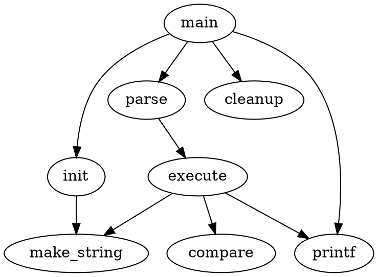
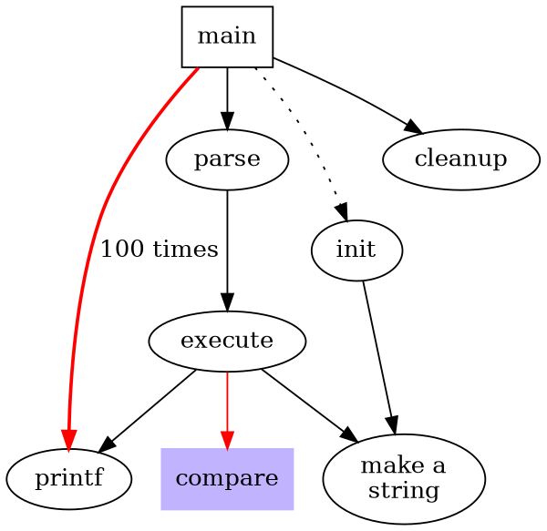

---
---

dot
-------

`dot` is a command-line utility to generate directed graphs. It has practical 
applications in everything from database design to software architecture and more.

Usage is trivial:

```bash
$ dot -T[output-format] -O <dot-files>
```

`-T` specifies the file type of the output (often `png` for images)  
`-O` specifies that the output file name should reflect the input file name.

---

`dot` requires that all input be in its special **dot language**. It's a
straightforward markup language, but has a large amount of possible 
customizations, far more than what can be summarized here. Visit the 
[DOT website](http://grahpviz.com) for detailed documentation. Also 
available there is the [DOT user guide](https://graphviz.gitlab.io/_pages/pdf/dotguide.pdf),
useful as an overview of some of the things `dot` can do.

<!--more-->

### Useful Options / Examples

#### A simple graph



``` bash
$ dot -Tpng -O simple.dot
```

Resulting output:


---

#### Styling and Colors



``` bash
$ dot -Tpng -O complex.dot.png
```

Resulting output:

